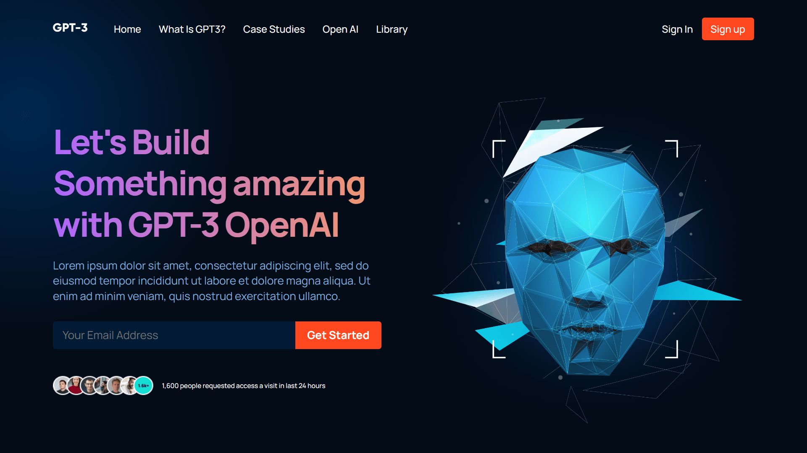

<div align="center">
    <a href="https://gpt3-fv.netlify.app" target="_blank">
      
    </a>
  <h3 align="center">GPT3 UI</h3>
</div>

##  <br /> 📋 <a name="table">Table of Contents</a>

- ✨ [Introduction](#introduction)
- ⚙️ [Tech Stack](#tech-stack)
- 📝 [Features](#features)
- 🚀 [Quick Start](#quick-start)

##  <br /> <a name="introduction">✨ Introduction</a>

**[EN]** This landing page features a modern design built with React, utilizing functional components for reusability and a structured file and folder system. It incorporates fundamental CSS properties for mastering Flexbox and Grid, adheres to the CSS BEM Model, and includes both soft animations and complex gradients. With perfectly placed media queries, the page ensures responsiveness across all devices.

**[FR]** Cette page d'accueil arbore un design moderne réalisé avec React, exploitant des composants fonctionnels pour leur réutilisabilité. Elle intègre des propriétés CSS essentielles pour maîtriser Flexbox et Grid, respecte le modèle BEM de CSS, et propose des animations subtiles ainsi que des dégradés complexes. Grâce à des media queries judicieusement placées, la page garantit une réactivité optimale sur tous les appareils.

##  <br /> <a name="tech-stack">⚙️ Tech Stack</a>

- [**React**](https://react.dev/reference/react) is a popular JavaScript library for building user interfaces, particularly single-page applications where data changes over time. React's component-based architecture allows developers to create reusable UI components, making development more efficient and the codebase easier to maintain. 

- [**Flexbox**](https://developer.mozilla.org/en-US/docs/Web/CSS/CSS_flexible_box_layout/Basic_concepts_of_flexbox) is a CSS layout module that simplifies the design and alignment of items within a container, allowing for flexible and responsive layouts without relying on floats or positioning hacks.

- [**Grid**](https://developer.mozilla.org/en-US/docs/Web/CSS/grid) (CSS Grid Layout), provides a powerful two-dimensional layout system for designing complex web layouts with precise control over rows, columns, and spacing, ideal for creating responsive and structured designs.

- [**BEM Model**](https://css-tricks.com/bem-101/) is a naming convention that organizes CSS classes into Blocks (standalone components), Elements (parts of blocks), and Modifiers (variations or states). It promotes modular and maintainable CSS code by enhancing clarity and reusability in styling web components.


## <br/> <a name="features">📝 Features</a>


👉 **CSS Variables**: Utilize CSS variables to maintain a consistent and easily adjustable styling approach throughout the project

👉 **Importing CSS Files**: Import CSS files into others, promoting modularity and organization in styling.

👉 **Flex and Position Properties**: Use of flex and position properties in CSS to create responsive and well-structured layouts.

👉 **Rendering HTML through JavaScript**: Rendering HTML through JavaScript using reusable functions, enhancing code efficiency.

👉 **Smooth Animations**: Smooth and subtle animations to enhance the overall user experience, focusing on fluid transitions.

👉 **BEM Method**: Follow the Block Element Modifier (BEM) methodology for naming classes, promoting a clear and maintainable structure.

👉 **Organized File and Folder Structure**: Maintain a well-organized file and folder structure for easy navigation and management of project assets.

👉 **Responsive Design**: The application is completely responsive across all devices, employing responsive design techniques such as media queries and fluid layouts.


## <br /> <a name="quick-start">🚀 Quick Start</a>

Follow these steps to set up the project locally on your machine.

<br/>**Prerequisites**

Make sure you have the following installed on your machine:

- [Git](https://git-scm.com/)
- [Node.js](https://nodejs.org/en)
- [npm](https://www.npmjs.com/) (Node Package Manager)

<br/>**Cloning the Repository**

```bash
git clone {git remote URL}
```

<br/>**Installation**

Let's install the project dependencies, from your terminal, run:

```bash
npm install
# or
yarn install
```

<br/>**Running the Project**

Installation will take a minute or two, but once that's done, you should be able to run the following command:

```bash
npm start
# or
yarn start
```

Open [`http://localhost:3000`](http://localhost:3000) in your browser to view the project.